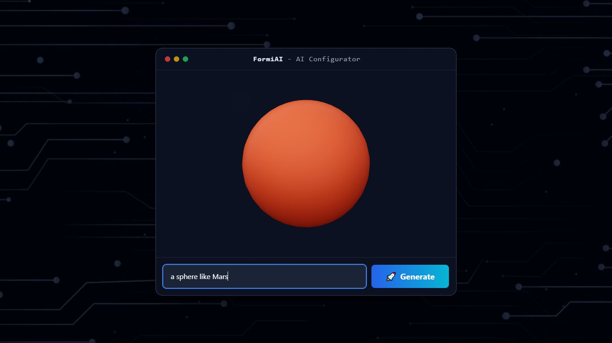

# FormiAI – Smart Form Configurator

A sleek and modern **AI-powered form configurator** built with **React + Vite + TailwindCSS**.  
Designed to showcase dynamic UI and quick customization. 🚀

---

## 📸 Demo

  


---

## 🔧 Tech Stack

- ⚛️ React (Vite)
- 🎨 TailwindCSS
- ⚙️ ESLint + PostCSS
- 📦 npm

---

## 🚀 Getting Started

Clone the repo and install dependencies:

```bash
git clone https://github.com/your-username/FormiAI.git
cd FormiAI
npm install
npm run dev
```

## 📂 Project Structure

FormiAI/
├── public/ # static files
├── src/ # source code
│ ├── assets/ # images, gifs, screenshots
│ ├── App.jsx
│ └── main.jsx
├── .env.example # environment variables template
├── package.json
└── README.md

✨ Features:
🎨 Modern responsive UI
⚡ Built with Vite for fast development
🛠 Easy to extend and customize
